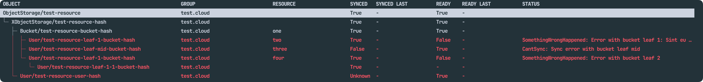

<h1 align="center">
  xpdig
</h1>

<p align="center">
  🧰 A terminal based UI to explore Crossplane traces
</p>



`xpdig` provides a terminal based UI (similar to `k9s`) to interactively explore
Crossplane traces,
making it easier to navigate, debug and understand objects. It leverages
`crossplane trace` to render the object tree.

## ✨ Features

### Trace

- ✨ Expanded details at a glance, with highlight colouring for possible issues
- 📖 Get, describe, edit and delete objects from the explorer, without the need
to separately execute `kubectl`
- 🔨 Use your own `$PAGER` and `$EDITOR` when exploring the traces
- 📋 Copy full qualified objects names straight from UI (API group + Kind + name)
via shortcut (`c`)
- ♻️ Automatically watch for changes on the resource
- ⏯️ Pause or unpause resources using the [`crossplane.io/paused` annotation](https://docs.crossplane.io/latest/managed-resources/managed-resources/#paused)

## 📀 Install

### Dependencies

⚠️ **You must have `crossplane`, `kubectl` and some pager (eg: `less`)
installed, since this application runs these within it.**

**The pager used can be customised via `PAGER` in your environment variables
(eg, `bat`). It defaults to `less`.**

### Linux and Windows

[Check the releases section](https://github.com/brunoluiz/xpdig/releases) for
more information details.

### MacOS

```
brew install brunoluiz/tap/xpdig
```

### Other

Use `go install` to install it

```
go install github.com/brunoluiz/xpdig/cmd/xpdig@latest
```

## ⚙️ Usage

```bash
# Loading a trace
## It supports XRs (non-namespaced objects)
xpdig trace XObject/hello-world
## It supports Claims (namespaced objects)
xpdig trace -n <namespace> Object/hello-world

# Support for other context (eg: dev/prod cluster)
xpdig trace --context <context> Object/hello-world

# Loading a trace generated by `crossplane beta trace -o json <>`
cat <trace.json> | xpdig trace --stdin
crossplane beta trace -o json <> | xpdig trace --stdin
```

### Navigation

- `h/?`: show help
- `arrow keys or j/k`: cursor up/down
- `c`: copies full qualified name to clipboard (API group + Kind + name)
- `enter/d`: executes `kubectl describe` on the resource
- `y`: executes `kubectl get` on the resource
- `e`: executes `kubectl edit` on the resource
- `ctrl+d`: executes `kubectl delete` on the resource (bear in mind it might dangle waiting for finalisers)
- `ctrl+x`: executes `kubectl patch` to remove all finalisers from the resource
- `p/u`: Pause/unpause the resource
- `/`: search (ENTER to submit, ESC to clear)
- `n/N`: navigate between search results
- `ctrl+f/ctrl+b | pageUp/pageDown`: jumps full page of results (up or down)
- `q/ctrl+c`: quit

### `k9s` integration

Since `k9s` [supports plugins](https://k9scli.io/topics/plugins/), there is a
basic configuration that can be copied to your own setup in [`k9s.yaml`](./k9s.yaml).

For MacOS users, you can copy the sample file to `~/Library/Application\ Support/k9s/plugins.yaml`,
while Linux users can copy to `$XDG_CONFIG_HOME/k9s/plugins.yaml`.

### Troubleshooting and debugging

In case the application is misbehaving, enable the logs by adding `--log [dst:./tmp/logs.json]`
and live tail the file to follow what is happening (eg, `tail -f ./tmp/logs.json`).

If `--log-level debug` is set, it will output all events received by the main
handler in `bubbles/app`. Bear in mind that this includes all Crossplane
traces, which might have sensitive metadata, such as: domain specific names,
labels etc.
